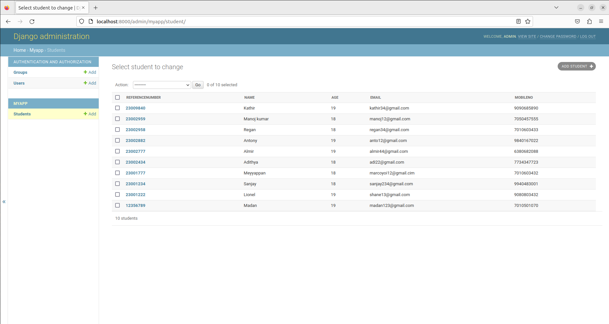

# Django ORM Web Application

## AIM
To develop a Django application to store and retrieve data from a database using Object Relational Mapping(ORM).

## Entity Relationship Diagram

## DESIGN STEPS

### STEP 1:
Close the empty repository from github

### STEP 2:
Under the directory Dataproject install a django project named 'myapp'.check database engine'sqlite'

### STEP 3:

Write our code in models.py and settings.py and admin.py .Then Run Djangoproject

## PROGRAM

#### models.py
   from django.db import models
   from django.contrib import admin
#### Create your models here.
class Student (models.Model):
    referencenumber=models.CharField(primary_key=True,max_length=20,help_text="reference number")
    name=models.CharField(max_length=100)
    age=models.IntegerField()
    email=models.EmailField()
    mobileno=models.IntegerField()

class StudentAdmin(admin.ModelAdmin):
    list_display=('referencenumber','name','age','email','mobileno')

## OUTPUT

## RESULT
The program is executed successfully
